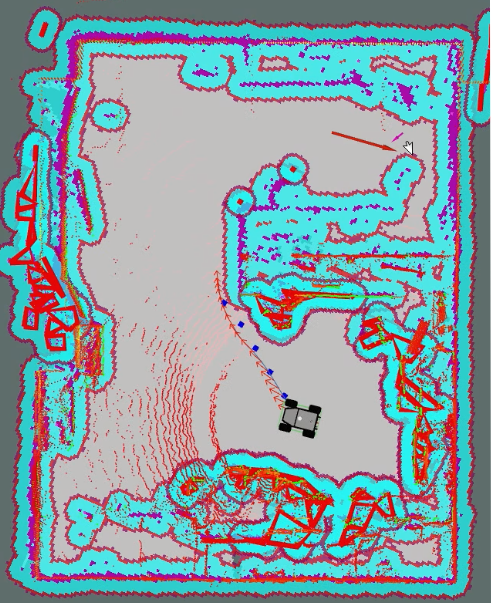
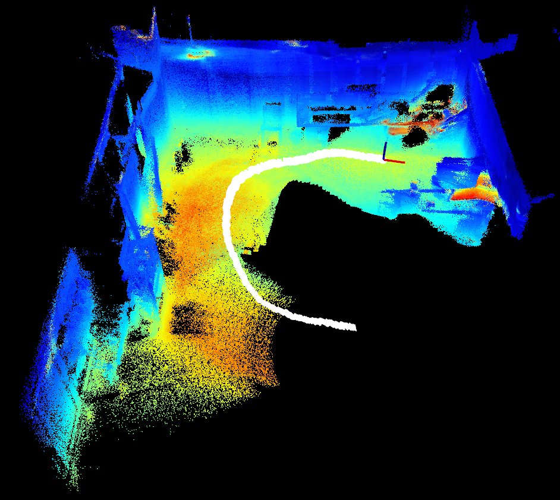

# TPC Mapping
This package provdies pan-tilt and camera integration along with the thermal mapping capabilities for the SUMMIT-XL Robot. The package implements the gmapping and R3live packages to create both navigational costmaps and thermal point clouds. This package is tested on Ubuntu 18.04 with ROS Melodic. 
<p align="center">
    
    
</p>

## Installation

**For the PTU**
- [flir_ptu_ethernet](https://github.com/RobotnikAutomation/flir_ptu_ethernet)
    - [robotnik_msgs](https://github.com/RobotnikAutomation/robotnik_msgs/)
    - [rcomponent](https://github.com/RobotnikAutomation/rcomponent/)
    - [robotnik_sensors](https://github.com/RobotnikAutomation/robotnik_sensors/)
- [flir_ptu](https://github.com/ros-drivers/flir_ptu)

**For the Camera**
- [Spinnaker SDK](https://www.flir.com/products/spinnaker-sdk/)
- [FLIR_camera](https://github.com/SMART-NYUAD/FLIR_camera/tree/kinetic-devel)
- [pointgrey_camera_driver](https://github.com/ros-drivers/pointgrey_camera_driver.git) (only image_exposure_msgs, statistics_msgs, and wfov_camera_msgs are specifically needed from this. **Recommended** to delete pointgrey_camera_description and driver to prevent errors)

**For R3LIVE**

Follow the prerequisites under their [Github Page](https://github.com/hku-mars/r3live). 


## Simulated Thermal Point Clouds
The TPCMapping package can be executed in simulation via gazebo. To do so, execute
```
roslaunch thermal_mapping tpc_gmapping.launch
```
To create a map of the simulated environment. Navigation can be simulated using a costmap through
```
roslaunch thermal_mapping tpc_costmap.launch
```

## Real-World Thermal Point Clouds
Real-world maps can be executed either live or through a bag file. To generate a map in real time, use the following:
```
roslaunch thermal_mapping tpcmapping.launch
```

Otherwise, a bag file can be created and then processed later. This can be done as follows:
```
roslaunch thermal_mapping record.launch
```
This will launch the visualization tool. Wait until you are receiving input from the LiDAR sensor before proceeding. When ready, record the topics to a bag file.
```
rosbag record -O record /thermal/image_raw_sync /thermal/image_raw_sync/compressed /robot/imu/data_raw /robot/ouster/points
```
After the bag file is created and completed, the thermal point cloud can be created later using:
```
roslaunch thermal_mapping bag.launch
```
ive
## PTU-Control
Files for controlling FLIR Pan Tilt Unit with the FLIR A65 Infrared Camera. 

**IP Addresses**

Make sure that the network is setup with a subnet mask of **255.255.255.0** with a network IP of **192.168.50.0**

- **PTU: 192.168.0.21**
- **FLIR Camera: 192.168.0.22**

### Usage: 

To launch with both the pan tilt and camera nodes: 
```
roslaunch ptu_control ptu_control.launch
```

To launch with just the pan-tilt node:
```
roslaunch ptu_control pan_tilt.launch
```

To launch with just the camera node:
```
roslaunch ptu_control camera.launch
```

All above launch files will initiate the Graphical User Interface for operating the relevant nodes, as seen below:  
<p align="center">
    
</p>

Commands for the pan tilt unit can be placed through the service caller via the **/pan_tilt** service. Alternatively, the service can be called directly through a command-line terminal via: 
```
rosservice call /pan_tilt "pan: 0.0
tilt: 0.0
max_pan_speed: 0.0
max_tilt_speed: 0.0" 
```
