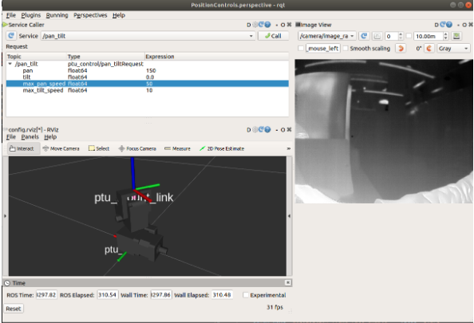

# PTU-Control
Files for controlling FLIR Pan Tilt Unit. Tested on Ubuntu 18.04 with ROS Melodic. 

## Installation
The following dependencies are needed for this node to work:

- [flir_ptu_ethernet](https://github.com/RobotnikAutomation/flir_ptu_ethernet)
- [flir_ptu](https://github.com/ros-drivers/flir_ptu)
- [Spinnaker SDK](https://www.flir.com/products/spinnaker-sdk/)


## Usage: 

To launch with both the pan tilt and camera nodes: 
```
roslaunch ptu_control ptu_control.launch
```

To launch with just the pan-tilt node:
```
roslaunch ptu_control pan_tilt.launch
```

To launch with just the camera node:
```
roslaunch ptu_control camera.launch
```

All above launch files will initiate the Graphical User Interface for operating the relevant nodes, as seen below:  
<p align="center">
    
</p>

Commands for the pan tilt unit can be placed through the service caller via the **/pan_tilt** service. Alternatively, the service can be called directly through a command-line terminal via: 
```
rosservice call /pan_tilt "pan: 0.0
tilt: 0.0
max_pan_speed: 0.0
max_tilt_speed: 0.0" 
```
